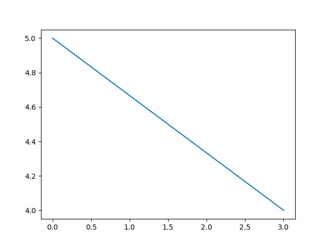

# FEM Solver
Python solver of the equation presented below usining Finite Element Method.
User should pass number of subdomains as input during operation of the program.

## Calculations

Mathematical paper with calculations used to obtain matrix form of the problem can be found [there](calculations_paper.pdf).

## Solution
Plot of the solution calculated using this [script](solver.py) where input value was 200.

